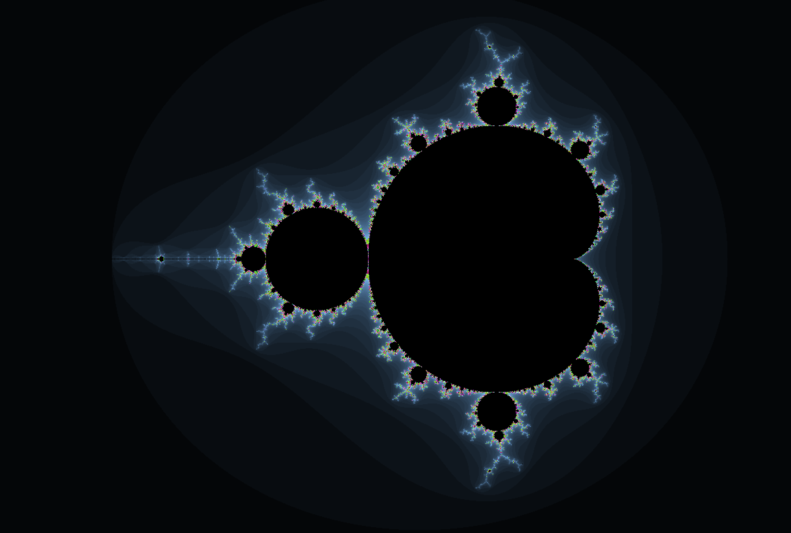
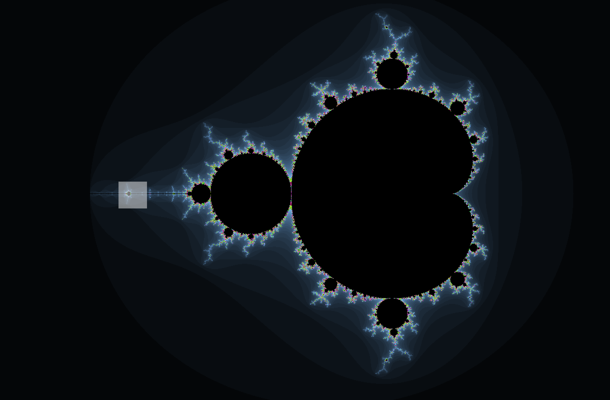
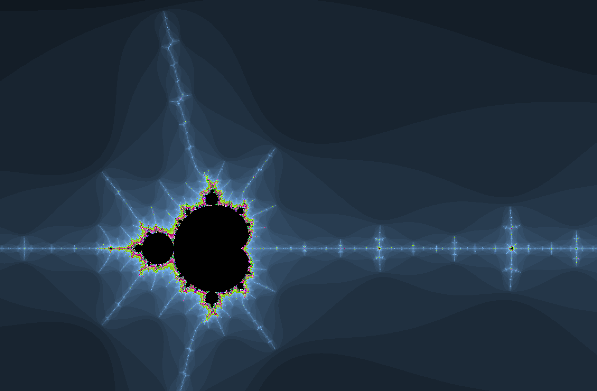
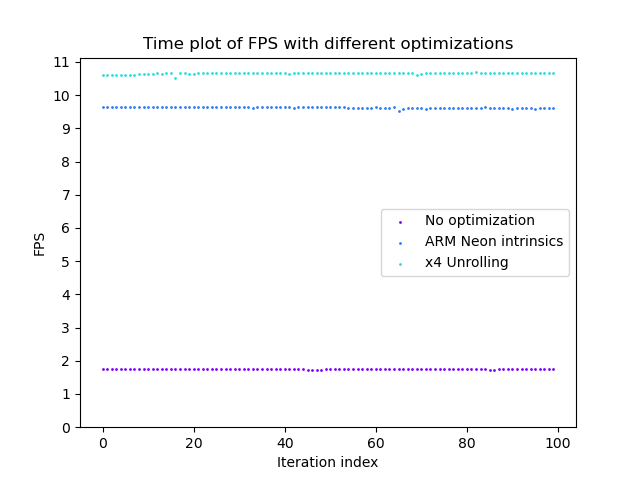
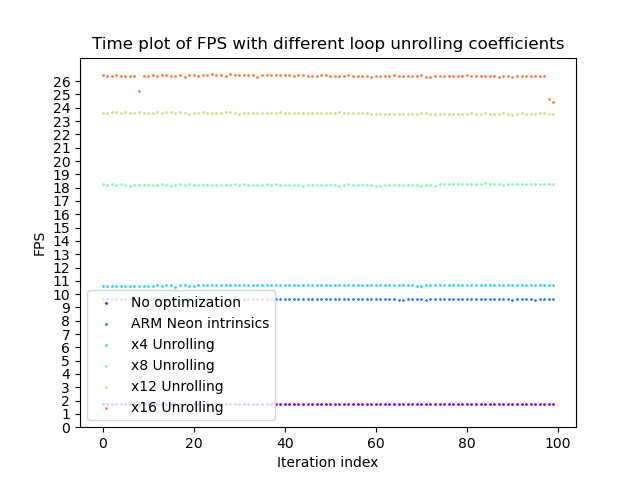
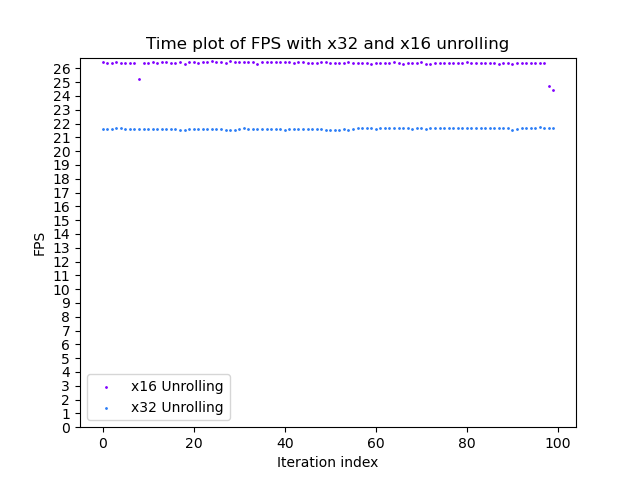

# Анализ различных стратегий оптимизации вычислений на основе отрисовки множества Мандельброта

<p align="center"> </p>

## О проекте
Данный проект реализует приложение, которое визуализирует множество Мандельброта, а также имеет функционал по проведению замеров производительности (под этим будем понимать количество кадров в секунду (FPS)).

**Что будет сравниваться:**
- 🐢 Базовая версия без оптимизаций
- 🚀 Версия с SIMD командами (ARM NEON интринсики)
- 🔄 Развертка циклов (с разными коэффициентами развертки)

По итогу будет составлена таблица, в которой можно будет увидеть среднее значение FPS для каждой версии, погрешность измерений и увеличение производительности по сравнению с базовой версией без оптимизаций.

## Установка и сборка

### Требования
- Компилятор C++ с поддержкой C++20
- SFML 3+
- pkg-config
- Make
- Matplotlib & numpy

Сначала склонируйте репозитирий к себе в систему:
```bash
git clone git@github.com:whiterno/Mandelbrot.git
```

В корневой папке проекта находится `Makefile`, поэтому для компиляции нужно просто воспользоваться командой:
```bash
make compile [PARALLEL_COEF=<coef>] [FLAG_ALGO=<flag>] [DOT_TYPE=<type>]
```

В [] обозначены дополнительные аргументы:
- `PARALLEL_COEF` - коэффициент развертки циклов
- `FLAG_ALGO` - флаг, отвечающий за включение алгоритмической оптимизации (не анализируется, но вы можете подключить его для ускорения отрисовки главной кардиоиды)
- `DOT_TYPE` - тип точек, отвечает за точность (если вы хотите сильно масштабировать фрактал, выбирайте double)

| Переменные Make | Стандартные значения | Возможные значения   |
| :-------------: | :------------------: | :------------------: |
| `PARALLEL_COEF` | 4                    | 4 / 8 / 12 / 16 / 32 |
| `FLAG_ALGO`     | 0                    | 0 / 1                |
| `DOT_TYPE`      | float                | float / double       |

Все компилируется с флагом `-O3`.

В корневой папке проекта появится исполняемый файл main.out, чтобы запустить программу пропишите в командной строке:
```bash
./main.out [--graphics-<optimization_type> | --no-graphics-<optimization_type>] [--tests=<test_amount>]
```

- `--graphics-<optimization_type>` - графика включена (--tests не будет влиять ни на что при данном флаге)
- `--no-graphics-<optimization_type>` - графика отключена, можно замерять производительность
- `--tests=<test_amount>` - устанавливает количество тестов отрисовки 1 кадра

| <optimization_type> |          Описание              |
| :-------------:     | :----------------------------: |
| `no-op`             | Базовая версия без оптимизаций |
| `arm`               | Подключение SIMD команд        |
| `op`                | Развертка циклов               |

Как только вы запустите программу в графическом формате, у вас появится окно с долгожданным множеством Мандельброта:

<p align="center"> </p>

В левом верхнем углу будет показываться FPS. С помощью следующих клавиш можно перемещаться и изменять масштаб:

| Горячая клавиша |     Описание       |
| :-------------: | :----------------: |
| ↑               | Перемещение вверх  |
| ←               | Перемещение влево  |
| →               | Перемещение вправо |
| ↓               | Перемещение вниз   |
| I               | Увеличить масштаб  |
| D               | Уменьшить масштаб  |
| Esc             | Закрыть программу  |

Выделив мышкой участок, можно переместиться в него:

<div style="display: flex;">
  
  
</div>

## Как строится множество Мандельброта?

Множество Мандельброта - это множество точек $c$ на комплексной плоскости, для которых рекуррентное соотношение $z_{n+1} = z_{n}^{2} + c$ задает ограниченную последовательность. Иными словами, это множество таких $c$, для которых существует такое действительное $R$, что неравенство $z_{n} < |R|$ выполняется для всех натуральных $n$. Возьмем $R = 2$.

Мы не можем построить бесконечную последовательность, поэтому будем проверять, если точка не вышла за границу $R$ на `ITERATIONS = 1024`, то она принадлежит множеству и имеет черный цвет, иначе множеству она не принадлежит. В изначальном варианте такие точки имеют белый цвет, но для более интересной картинки можно задать функцию цвета от итерации, на которой точка вышла за границу $R$.

Если же разделить комплексную точку на действительную и мнимую части, то получим следующее:
$$c = x_{0} + iy_{0}$$
$$x_{n+1} = x_{n}^{2} - y_{n}^{2} + x_{0}$$
$$y_{n+1} = 2x_{n}y_{n} + y_{0}$$

В базовой версии без оптимизаций считаем через комплексную точку (с помощью созданой структуры `Complex_t`).

В версии с SIMD и разверткой циклов используем разделение на действительную и мнимую части, так как это позволяет нам применять данные оптимизации.

## Тесты
Мы будем анализировать оптимизации с флагом `--tests=100`, то есть для каждой версии считается FPS отрисовки 100 кадров. Если вы хотите протестировать на своей машине, то можете запустить скрипт:
```bash
./runTests.sh
```

Все данные будут записываться в папку tests/data/.

Чтобы построить график FPS от индекса итерации, запустите скрипт:
```bash
./tests/plot/plot.sh
```

Графики появятся в папке tests/plot/imgs.

## Сравнение оптимизаций

> [!NOTE]
> **Процессор:** Apple M3 Pro.
>
> **Операционна система:** macOS Sequoia 15.2
>
> **Компилятор:** Apple clang version 16.0.0 (clang-1600.0.26.6)
>
> **Расширение окна:** 1200x816
>
> **Количество итераций на точку:** 1024
>
> **Таблица с вычислениями:** <a href="https://docs.google.com/spreadsheets/d/1Hw-Hk9E4eqzq9djHwZmG_Sc3bbEpzlzbmcZPhU6_9Wc/edit?usp=sharing">таблица</a>
>

В начале каждого тестирования 10 секунд (выбрано эмпирическим методом) процессор работает в холостую, чтобы повысить свою температуру и выйти на плато стабильности. Это сделано для того, чтобы значения, которые мы получим, не зависели от времени проведения тестирования. Нам необходимо получить зависимость только от внедренных оптимизаций.

Запустим сначала базовую версию программы без оптимизаций:

| Базовая версия            |        |
| :-----------------------: | :----: |
| Средний FPS               | 1,74   |
| Стандартное отклонение    | 0,0104 |
| Относительная погрешность | 0,0059 |

Все довольно грустно, каждая точка отдельно просчитывается в функции, записывается в массив, даже флаг `-O3` с таким не справляется при данном разрешении и количестве итераций. Процессор не загружен, мы подаем ему задачи последовательно. Можно это исправить. Есть способ распараллелить данные - использовать векторные инструкции, принцип SIMD. Мы можем просчитывать сразу несколько точек одновременно.

Тестирование проходит на машине с процессором Apple M3 Pro, который имеет архитектуру ARM, поэтому будем пользоваться набором команд ARM NEON. Максимальная битность регистра - 128, поэтому одновременно можно обрабатывать только 4 значение float (по 32 бита каждый).

Но в таком решении присутствуют свои подводные камни. Для быстрой работы с интринсиками необходимо выравнять переменные, которые содержат данные о точках, на 128 бит (16 байт) и использовать флаг `-O3`, иначе они могут работать даже медленнее версии без оптимизаций. Также у нас увеличивается количество точек, которые необходимо проверить на выход за $R$. Если одна из точек вышла за границу, а другая нет, мы не можем остановить обработку данного набора точек. Остановка возможно только в случае, если все точки превысили $R$.

| ARM NEON интринсики       |        |
| :-----------------------: | :----: |
| Средний FPS               | 9,60   |
| Стандартное отклонение    | 0,0503 |
| Относительная погрешность | 0,0052 |

Мы смогли увеличить производительность в 5,5 раз! Теперь воспользуемся другим методом оптимизаций - разверткой циклов. Будем обрабатывать несколько точек за 1 итерацию цикла. Такой метод позволяет уменьшать количество проверок цикла, соответственно связанные с циклом риски (ложное предсказание при jmp), а так же заполнять конвейер процессора, чтобы он обрабатывал 2, 3 и т.д. точки вместо того, чтобы проверять условия перехода или впустую работать из-за ложного предсказания.

В таком случае нужно позаботиться о написании кода, в котором не будет зависимостей по данным, чтобы выжать максимум из данного метода. Присутствуют и минусы: при развертывании больших циклов растет объем кода, что в свою очередь негативно сказывается на обращении к памяти и попаданию по кешу инструкций.

| Развертывание цикла x4    |        |
| :-----------------------: | :----: |
| Средний FPS               | 10,63  |
| Стандартное отклонение    | 0,0714 |
| Относительная погрешность | 0,0067 |

Ускорение по сравнению с инстринсиками в 1,1 раз, а с базовой версией - 6,1! Давайте разберемся, почему так произошло.

Откроем objdump программы и найдем функцию, которая использует развертку циклов:
```asm
100002160: 6e63dc78    	fmul.2d	v24, v3, v3
100002164: 6e71de39    	fmul.2d	v25, v17, v17
100002168: 6e74de9a    	fmul.2d	v26, v20, v20
10000216c: 6e76dedc    	fmul.2d	v28, v22, v22
100002170: 6e65dcbb    	fmul.2d	v27, v5, v5
100002174: 6e67dcfd    	fmul.2d	v29, v7, v7
100002178: 6e73de7e    	fmul.2d	v30, v19, v19
10000217c: 6e77deff    	fmul.2d	v31, v23, v23
```

Важно, что компилятор использует 128 битные регистры v. Код написан дружелюбно по отношению к компилятору, что позволяет ему самому использовать векторные инструкции. А компилятор явно лучше знает, как использовать их для максимальной производительности. Это объясняет то, что FPS увеличился.

По итогу получаем такой график:

<p align="center"> </p>

Теперь встает другой вопрос: насколько далеко мы можем зайти с развертыванием циклов? Давайте проведем тесты для x8, x12, x16:

| Развертывание цикла x8      |        |
| :-------------------------: | :----: |
| Средний FPS                 | 18,17  |
| Стандартное отклонение      | 0,2075 |
| Относительная погрешность   | 0,0114 |
| Ускорение по сравнению с x4 | 1,7    |

| Развертывание цикла x12     |        |
| :-------------------------: | :----: |
| Средний FPS                 | 23,63  |
| Стандартное отклонение      | 0,3    |
| Относительная погрешность   | 0,0165 |
| Ускорение по сравнению с x4 | 1,3    |

| Развертывание цикла x16     |         |
| :-------------------------: | :-----: |
| Средний FPS                 | 26,03   |
| Стандартное отклонение      | 0,1817  |
| Относительная погрешность   | 0,0069  |
| Ускорение по сравнению с x4 | 1,1     |

<p align="center"> </p>

И таким образом мы смогли увеличить производительность в 14,9 по сравнению с неоптимизированной версией! Имеет ли смысл идти дальше и увеличивать до 32, 64? Нет, таким образом мы можем не только не ускорить отрисовку, но и замедлить ее. Увеличение скорости имеет ограничение в идеальную укладку конвейера, как мы видим ускорение уменьшается 1,7 -> 1.3 -> 1.1. При увеличении коэффициента развертки придется использовать больше памяти, что приведет к непопаданиям по кешу инструкций.

| Развертывание цикла x32      |               |
| :--------------------------: | :-----------: |
| Средний FPS                  | 21,38  |
| Стандартное отклонение       | 0,0832 |
| Относительная погрешность    | 0,0038 |
| Ускорение по сравнению с x16 | 0,8213 |

Как и ожидалось, развертывания цикла x32 работает медленнее, чем x16.

<p align="center"> </p>

## Вывод

Распараллеливание вычислений, дружелюбный для компилятора код могут сильно увеличить производительность программы. Важно понимать процессы, которые происходят внутри машины, чтобы точно знать, что может ей помочь, а что навредить.

## Красивые картинки множества Мандельброта

<p align="center"> </p>
<p align="center"> </p>
<p align="center"> </p>
